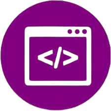

  

# Gallery Components | Conheça meus components reutilizaveis 

     <a href="https://icarojordano.github.io/GalleryComponents/">📱 Visite o Projeto</a>

 

## 📝 Descrição do Projeto

O Gallery Components é uma aplicação web que apresenta uma coleção de componentes de interface de usuário (UI) reutilizáveis, organizados em uma galeria interativa. Cada componente é exibido com seu design e funcionalidade, servindo como referência visual e técnica para desenvolvedores e designers.

### O que o projeto resolve

- Facilita a visualização e compreensão de componentes UI reutilizáveis.
- Serve como uma biblioteca visual para inspiração e referência em projetos de design e desenvolvimento.
- Auxilia na padronização de componentes em projetos, promovendo consistência na interface do usuário.
 

## 💻 Tech Stack

<!--- # "Verify icons availability here https://github.com/tandpfun/skill-icons" -->

 
 
 

<h2 id="layout">🎨 Layout</h2>

    
    

 
 
 

## 🧩 Features

- [x] Componentes de UI reutilizáveis | Uma coleção organizada de componentes prontos para uso em projetos web.
- [X] Visualização em tempo real | Cada componente pode ser visualizado com seu estilo e comportamento aplicado diretamente na galeria.
- [X] Organização por categorias | Componentes agrupados por tipos (ex: botões, cards, navegação) para facilitar a navegação.
- [X] Interatividade | Os componentes possuem estados ativos, hover e respostas visuais para interações do usuário.
- [X] Design responsivoo | Todos os componentes se adaptam a diferentes tamanhos de tela (mobile, tablet, desktop).
- [X] Referência visual e técnica | Útil como um guia para desenvolvedores e designers manterem consistência visual entre projetos.
- [X] Fácil manutenção e escalabilidade | Estrutura baseada em React para facilitar a adição e edição de componentes no futuro.

<h2 id="colab">🤝 Collaborators</h2>

Agradecimento especial a todas as pessoas que contribuíram para este projeto.

<table>
  <tr>
    <td align="center">
      <a href="#">
         
        
          <b>Icaro Jordano | Desenvolvedor 
            e Tech Manager</b>
        
      </a>
    </td>
    
  </tr>
</table>
